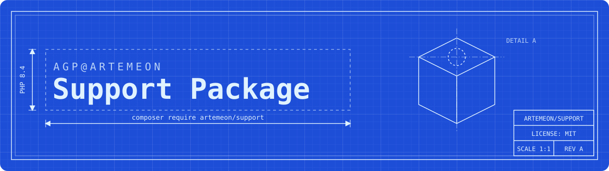

<p align="center"></p>

# AGP@ARTEMEON Support Package

[](https://github.com/artemeon/support/actions/workflows/ci.yml)

[](https://packagist.org/packages/artemeon/support)

Shared helpers for the AGP@ARTEMEON software suite: dates, strings, JSON, pagination iterators and a small full-text matcher.

## Requirements

- PHP 8.4 or newer
- `ext-mbstring`
- `illuminate/support` 11 or 12, `nesbot/carbon` 3

## Installation

```bash
composer require artemeon/support
```

## Usage

### Date

`Artemeon\Support\Date\Date` wraps the AGP "long timestamp", a 14-digit `YmdHis` string such as `20261001143000`.

```php
use Artemeon\Support\Date\Date;

$date = new Date('20261001143000'); // 14 digits: long timestamp
$date = new Date(1790000000);       // anything else: Unix timestamp
$date = new Date();                 // now
$date = Date::fromDateTime(new DateTimeImmutable());
$date = Date::createFromFormat('d.m.Y', '01.10.2026');

$date->getYear();             // 2026
$date->format('d.m.Y H:i');   // "01.10.2026 14:30"
$date->getLongTimestamp();    // "20261001143000"
$date->isGreater(Date::now());
```

The methods from `DateInterface` (`with*`, `add`, `sub`, `setDate`, `setTime`) return a new instance. The older `set*` methods change the instance in place:

```php
$next = $date->withNextMonth(); // $date is unchanged
$date->setNextDay();            // $date is modified
```

`add()`/`addInterval()` and `sub()`/`subtractInterval()` keep the result between `Date::MIN_TIMESTAMP` and `Date::MAX_TIMESTAMP`.

### StringUtil and Stringable

`StringUtil` extends Laravel's `Str`, and `StringUtil::of()` returns an `Artemeon\Support\Stringable`, so all Laravel string helpers are available too. The package adds:

```php
use Artemeon\Support\StringUtil;

StringUtil::indexOf('Hello World', 'world', caseSensitive: false); // 6
StringUtil::toInt('42');           // 42 (null if not numeric)
StringUtil::toFloat('4.2');        // 4.2
StringUtil::toArray('a,b,c');      // ['a', 'b', 'c']
StringUtil::toDate('20261001143000'); // Date
StringUtil::br2nl('a<br />b');     // "a\nb"
StringUtil::removeScriptTags($html);
StringUtil::xmlSafeString($text);
StringUtil::jsSafeString($text);
StringUtil::parseUrlString('a=1&b[]=2');
StringUtil::isNullOrEmpty(null);   // true

StringUtil::of(' Hello World ')->trim()->indexOf('World'); // 6
```

### JSON

`JSON` wraps `json_encode`/`json_decode` with `JSON_THROW_ON_ERROR` always on:

```php
use Artemeon\Support\JSON;

JSON::encode(['a' => 1]);           // '{"a":1}'
JSON::decode('{"a":1}', true);      // ['a' => 1], throws JsonException on invalid input
JSON::decodeSilently('{oops');      // null instead of throwing
JSON::decodeAsArray('[1,2]');       // throws if the result is not an array
JSON::decodeAsObject('{"a":1}');    // throws if the result is not an object
JSON::validate('{"a":1}');          // true
```

`JsonDecoder` is deprecated. Use `JSON` instead.

### Pagination

`ArrayIterator` paginates an array that is already in memory:

```php
use Artemeon\Support\ArrayIterator;

$iterator = new ArrayIterator(range(1, 40));
$iterator->setPerPage(15);
$iterator->getTotalPages(); // 3
$iterator->getForPage(3);   // [31, ..., 40]
```

`ArraySectionIterator` is for server-side paging, where you only load the rows of the current page. It also implements `ArrayAccess`, `Countable` and `JsonSerializable`:

```php
use Artemeon\Support\ArraySectionIterator;

$iterator = new ArraySectionIterator(totalItems: 95);
$iterator->setPerPage(10);
$iterator->setPage(2);

// Fetch rows $iterator->getStart() (10) to $iterator->getEnd() (19) from the database...
$iterator->setSection($rows);

$iterator->toJson();
// {"lastPage":10,"hasPrev":true,"hasNext":true,"totalEntries":95,"itemsPerPage":10,"page":2,"entries":[...]}
```

### FullText

`FullText` scores how well a query matches a set of values. A higher score means a better match. Exact, prefix, substring and similar (≥ 80 %) token matches all count, and earlier query tokens weigh more.

```php
use Artemeon\Support\FullText;

$score = FullText::make('Jane', 'Doe', 42)->search('jane'); // 16100.0
FullText::make('Jane')->search('john');                     // 0.0
FullText::make('Jane')->search('');                         // 1.0 (empty query matches everything)
```

### Timer

```php
use Artemeon\Support\Timer;

$timer = new Timer();
$timer->start();
// ...
$timer->getDurationInSeconds(); // e.g. 0.012345, stops the timer if end() wasn't called
```

### LinkInterface

`LinkInterface` is a contract for link objects with query parameters: `withParameters()`, `withParameter()`, `getParameters()` and `getHref()`.

## Development

```bash
composer install
composer test               # Pest
composer test:coverage      # Pest with line coverage (min. 97.4 %)
composer test:type-coverage # type coverage (100 %)
composer test:mutate        # mutation testing (100 %)
composer phpstan            # PHPStan, level 10
composer pint               # code style
```

CI runs the tests and PHPStan on PHP 8.4 and 8.5, and the other checks on PHP 8.5.

## License

MIT, see [LICENSE](LICENSE).
